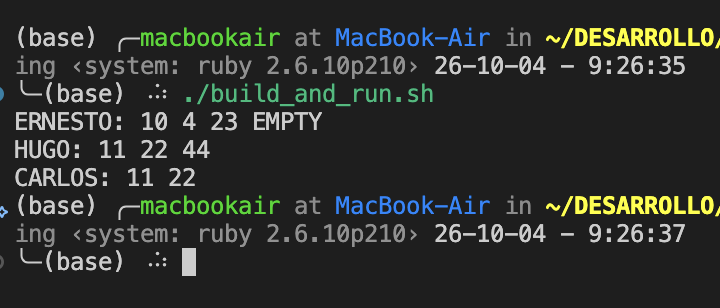

# tarea4-pa

Tarea 4 de Programacion Avanzada: implementar en C una tabla hash que permita
asociar varios valores de texto con una misma clave de texto.

La tabla usa encadenamiento para resolver colisiones y aumenta su capacidad automáticamente. `hash_table_add` agrega valores sin reemplazar los existentes,
`hash_table_get` devuelve la lista de valores de una clave y
`hash_table_destroy` libera toda la memoria reservada.

Para compilar y ejecutar el ejemplo:

```sh
mkdir -p build
gcc main.c -o build/main.o
./build/main.o
```

o

```sh
./build_and_run.sh
```
